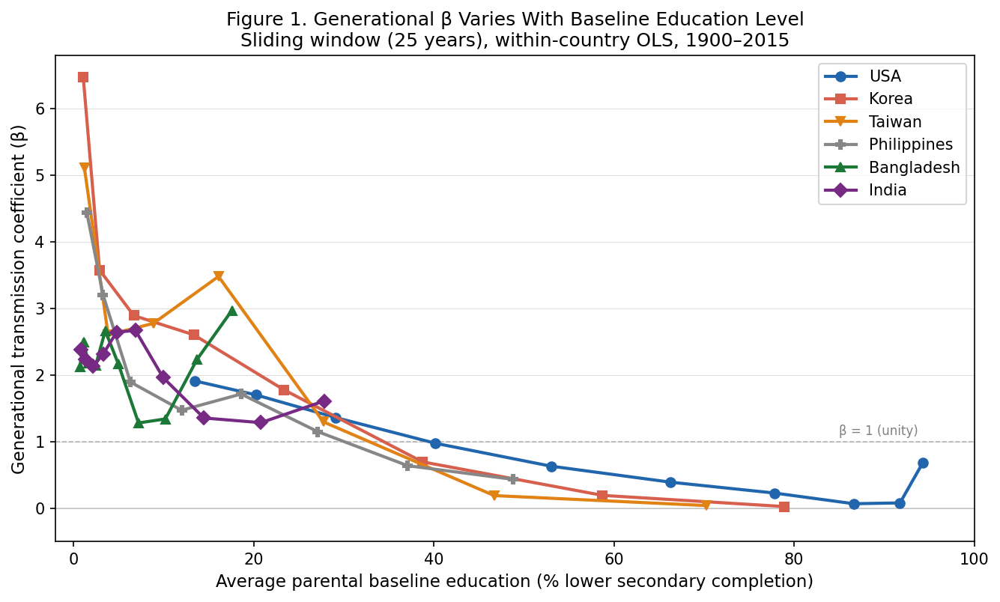
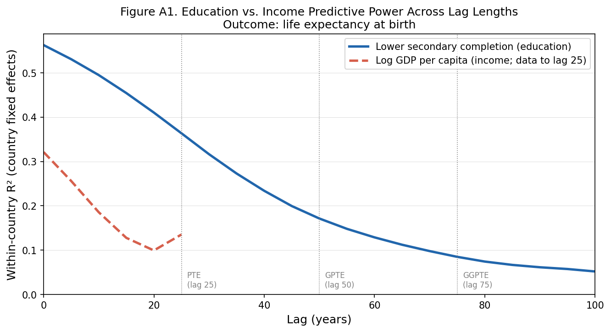

# Education as the Sole Primary Driver of Human Development: Against Sen's Bifurcation of Development Pathways

**Krishna Pagadala**

*Working paper, 2026*

---

## Abstract

Sen's distinction between growth-mediated and support-led security has structured development policy for four decades. We argue it is wrong in its identification of cause: neither income nor direct provision is an independent mechanism of human development. Both are downstream of education. Income is generated by educated workforces. Provision is demanded by educated populations and effective only when they can use it. Education is the sole primary driver — the only input that passes the asymmetry test of primacy: remove it and nothing else works; remove income and education still works (Bangladesh crossed both development thresholds at $1,159 per capita); remove provision and education still works (Korea and Taiwan achieved development with minimal welfare states). "Sole primary" is precise: nutrition has been at subsistence baseline for millennia and endemic disease (malaria, bilharzia, helminth loads) has been the ambient human condition for longer — every successful educational rupture was made through both, not after solving them (Section 2.4). Even basic formal education represents a categorical discontinuity from culturally transmitted knowledge — PTE transmits the fact of exposure, not test scores — so neither education quality nor endemic disease undermines the mechanism — the educational rupture operates at a scale (tens of percentage points per generation) where endemic disease attendance effects are noise on the signal, and the historical record shows no successful rupture was preceded by disease clearance (Section 5.1). Physical security is not a precondition — Sri Lanka's 26-year civil war and Myanmar's continuous conflict since 1948 did not break the educational trajectory; both saw TFR fall and LE rise on schedule. The mechanism fails only when the educated population itself is destroyed (Cambodia, Uganda under Amin) — the rarest of events, not a policy-relevant precondition.

We operationalise development as simultaneously crossing a total fertility rate (TFR) below 3.65 and life expectancy (LE) above 69.8 years — the 1960 United States values (World Bank WDI). Using 187-country panel data (WCDE v3, 1975–2015) with country fixed effects and a 25-year generational lag, parental lower secondary completion predicts within-country educational outcomes at R²=0.455, nearly double GDP alone (R²=0.256). Education predicts GDP, life expectancy, and fertility one PTE interval forward (Table 2); GDP predicts education forward with similar reduced-form strength (R²≈0.26–0.27 in both directions). Both variables are mutually endogenous — the asymmetry is not in predictive power but in durability: educational gains never depreciate across generations — β is always positive, approaching zero only at near-universal completion (Figure 1) — unlike health expenditures or income, which require continuous spending. The state creates the educational rupture; Parental Transmission of Education (PTE) makes it irreversible.

Sen's canonical cases confirm rather than challenge this account. Kerala, Sri Lanka, China, Taiwan, and South Korea each crossed the development threshold at the interval that PTE (~25 years, one generational cycle) predicts from their prior education investment — not from when provision programmes were introduced. The variation in lag length is explained by two independently measurable parameters: the speed of the educational expansion relative to the starting base, and whether structural disruption to the life expectancy pathway occurred during the compounding period. These findings extend Easterlin (1981) and Lutz & Kebede (2018) to within-country identification of the generational mechanism and directly challenge institutions-first accounts.

**Keywords:** education; generational transmission; human development; Preston Curve; PTE; GPTE; GGPTE; Sen; leapfrog development; educational rupture

---

## 1. Introduction

In *Hunger and Public Action* (Drèze & Sen, 1989), Amartya Sen drew a distinction that became foundational to development thinking: some countries secure welfare through economic growth (growth-mediated security); others through direct state provision regardless of income (support-led security). Kerala, Sri Lanka, and China were the paradigm cases of the second type — populations with welfare outcomes far above what their incomes predicted.

The framework was politically important. It challenged the then-dominant view that growth was the necessary precondition for welfare and opened space for direct intervention. Its influence on the Millennium Development Goals, the Human Development Index, and direct service delivery programmes across the developing world is difficult to overstate.

We argue the framework is wrong in a specific and consequential way — not incomplete, but causally backwards on both ends. Sen's two categories are not competing mechanisms. They are the same mechanism — education — producing two different surface appearances depending on the speed of educational expansion and the presence of functioning markets. Where educational expansion is fast and markets function, the mechanism produces rapid visible income growth; that income growth gets credited as the cause. Where expansion is slow and markets are absent, income growth is invisible; state services are the only observable welfare activity and they get credited instead. Sen observed the surfaces and built a causal typology from them.

Education is the sole primary driver. This claim requires precise definition. It does not mean education explains all variance in welfare outcomes, or that income and institutions have zero effect at the margin. It means education is the *necessary condition* — the asymmetric input without which no other mechanism operates independently. Remove income, and education still works: Bangladesh crossed both development thresholds at $1,159 per capita. Remove the state health apparatus, and education still works: Korea and Taiwan achieved development with minimal welfare states. Remove education, and neither income nor services work: Uganda at $1,000 per capita had higher life expectancy than India in 1960, then watched Amin destroy both the provision and the educated population that could have rebuilt it. The asymmetry defines primacy. No other variable survives this test.

The institutional consequence is direct. OECD Development Assistance Committee data shows health has consistently received 2–3× the aid allocation of education across the post-MDG period; within education aid, secondary receives a fraction of what primary receives (OECD DAC, 2022). Every low-income finance minister knows that announcing a health programme attracts bilateral donors and multilateral loans; announcing a secondary school construction programme attracts far less. This tilt is the policy legacy of Sen's framework and it systematically underfunds the only mechanism that compounds across generations.

The Millennium Development Goals organized reporting around five direct health metrics and one primary enrollment target — not secondary completion. The SDGs made the hierarchy explicit: SDG 1 is No Poverty, SDG 2 is Zero Hunger, SDG 3 is Good Health, SDG 4 is education. This ordering is not an accident of numbering; it is Sen's causal model institutionalized. The MDG/SDG health achievements — child mortality reductions, maternal mortality improvements — are not evidence that this ordering is correct. They are evidence that the global educational rupture since 1950 produced the institutional capacity to deliver health technology internationally: WHO, UNICEF, GAVI, and PEPFAR are staffed by educated workers deploying welfare technology to populations still building their own educational base. Those gains are real and do not compound. They persist only as long as external delivery continues and do not change the underlying generational trajectory unless domestic educational investment follows.

One limitation bears stating at the outset. The paper's central rebuttal to Sen — that direct provision is endogenous to education, demanded and used by educated populations rather than operating as an independent mechanism — is supported by indirect evidence but not directly tested. The direct test would require health expenditure panel data at country-year resolution linked to prior education levels, which is not available at the coverage required. We offer two indirect tests (Section 10) and the development-timing evidence in Section 7, but readers should weight the provision endogeneity claim accordingly: it is theoretically motivated and consistent with all available evidence, but not directly identified.

The purpose of this paper is to establish the education-only account empirically and theoretically. Section 2 develops the theoretical framework from Easterlin (1981) through Lutz & Kebede (2018) to the generational transmission mechanism (PTE). Section 3 defines development concretely. Section 4 addresses causal identification — the bad control problem and natural experiments. Section 5 presents the empirical evidence. Section 6 reports results. Section 7 provides the decisive test: when did Sen's canonical cases actually develop, and does the timing track education or tempo of expansion? Section 8 addresses the institutional challenge. Section 9 discusses the educational rupture as the one exogenous political decision from which everything else follows. Section 10 states limitations.

---

## 2. Theoretical Framework

### 2.1 Easterlin's Founding Argument

The education-first account of development has a precise starting point. Easterlin (1981), in "Why Isn't the Whole World Developed?", asked why modern economic growth had failed to diffuse uniformly given the post-war availability of production technology. His answer was specific: the binding constraint was the absence of mass schooling systems. Technology transfers when it encounters a literate, numerate population capable of deploying it. Without that population, it does not transfer, regardless of capital access or external assistance.

Easterlin located this empirically in the historical spread of education systems. The divergence in economic growth between early and late industrializers tracked the divergence in mass schooling — driven originally by the Protestant Reformation's insistence on personal scripture-reading, which produced mass literacy as a side-effect of religious practice across Northern Europe. The distribution of development in 1960 was substantially the distribution of schooling in 1860. Goldin & Katz (2008) provide the most thorough historical documentation of this transmission for the United States: the US "human capital century" of 1910–1940, driven by the high school movement, explains the majority of twentieth-century income growth — a within-country longitudinal result consistent with the cross-country generational mechanism estimated here.

### 2.2 Lutz and the Preston Curve

Lutz & Kebede (2018) take Easterlin's historical argument into the data. They reinterpret the Preston Curve (Preston 1975) — the positive relationship between national income and life expectancy — by replacing income with education on the x-axis. Three findings emerge. First, the education–life expectancy relationship is tighter than the income–life expectancy relationship. Second, and more important, the upward shift of the curve over time — the fact that populations live longer today at the same income levels than in 1960 — largely disappears when education is on the x-axis. The "wealth buys health" reading of the Preston Curve is an education story that income was proxying for, because income and education are correlated but income is downstream of education in the causal chain (Lutz 2009). Third, and directly relevant to the scope of educational investment: the education–life expectancy relationship shows no diminishing returns at higher education levels. Unlike income, which follows the classic concave Preston shape, the education curve remains approximately linear from primary through tertiary. Lutz attributes this to a cognitive mechanism: education changes the brain's capacity for planning, learning from mistakes, and health-oriented decision-making across the entire life course, and these gains accumulate at all levels of schooling. The implication is that the case for educational investment does not weaken as countries progress toward universal secondary; pushing further into upper secondary and tertiary produces continued life expectancy gains. This is consistent with our WCDE panel: among 70 countries with lower-secondary completion above 85% in 2010, college completion carries a within-group correlation of r=0.44 with life expectancy, with mean life expectancy rising from 73.5 years in the lowest college-completion quartile to 79.0 years in the highest — a 5.5-year gradient that emerges among countries that have already solved the lower-secondary problem.

Deaton (2013) offers an alternative account of the curve's upward shift: global diffusion of health knowledge and technology — antibiotics, vaccines, oral rehydration therapy — produced life expectancy gains independent of both income and education. This account is not inconsistent with the education-primary claim but clarifies the mechanism: technology diffuses in principle to all countries simultaneously, yet uptake is not uniform. The differential uptake tracks education. It is educated mothers who consistently vaccinate their children; it is literate communities that follow oral rehydration protocols; it is educated populations that build the political demand for the health infrastructure that distributes the technology. Deaton identifies what became available globally; education identifies who could use it.

Lutz & Kebede (2018) document one further finding that bears directly on this point: life expectancy at the lowest education level in 2010 *exceeds* the 1970 baseline for that same level — the only level at which a genuine upward Preston Curve shift remains when education replaces income on the x-axis. This residual is the global educational rupture operating through international institutions: educated actors — in wealthy countries, developing-country governments, and international organisations alike — produced vaccines, antibiotics, and oral rehydration protocols; educated supply chains distributed them; educated administrators at WHO and UNICEF directed them to the populations with the lowest educational bases. This is provision, but provision that is education-mediated at the system level. The doctors arrived from outside because the educational base inside was absent. Sen's "support-led security" in its MDG-era form is not evidence that provision works without education. It is evidence that a sufficiently educated global class can deliver welfare externally to populations still building their own educational base — temporarily and without compounding, but real. The welfare gains are education-caused; the education is simply not yet domestic.

### 2.3 The Generational Transmission Mechanism: PTE, GPTE, GGPTE

The micro-level process connecting these macro observations is generational transmission. We introduce a three-level taxonomy that unifies the observed variation in development lag lengths:

- **PTE** (Parental Transmission of Education): the child's educational attainment is predicted by the parent's, with an approximately 25-year lag. This is the base unit of the mechanism.
- **GPTE** (Grandparental Transmission of Education): the grandparent's education predicts the grandchild's, operating across approximately 50 years through two sequential PTE cycles.
- **GGPTE** (Great-Grandparental Transmission of Education): three cycles, approximately 75 years.

The unit interval is not assumed. A woman completing lower secondary at age 15–18 has children reaching school age 20–30 years later. Across a 140-year panel (28 countries, 1900–2015), the average within-country generational coefficient is FE β=0.960, reflecting both state-driven expansion at low baselines (where β exceeds unity — state investment and household transmission compound, producing more than 1pp of child gain per parental pp) and household transmission that ensures gains persist as countries approach universal completion. The critical property is that β is always positive: educational gains never depreciate across generations, unlike health expenditures or income, which require continuous spending to maintain. This durability is PTE's distinctive contribution — the mechanism that makes educational investment uniquely irreversible. The full lag profile — measured empirically at every year from lag 0 to lag 100 — confirms that the transmission signal persists across all three generational depths: R²=0.364 at lag 25 (PTE), R²=0.171 at lag 50 (GPTE), R²=0.085 at lag 75 (GGPTE) (Figure A1; outcome: life expectancy, within-country FE).

The taxonomy directly explains the variation in development lag lengths across cases. Countries whose educational expansion was decisive and rapid crossed at PTE distance. Countries whose educational base was built gradually across two generations crossed at GPTE distance. Countries where education accumulated through social reform over three or more generations crossed at GGPTE distance. The lag length is not a free parameter fitted to match each case — it is the number of generational cycles required to compound from the starting educational base to the threshold at which the demographic transition engages. This answers directly why Taiwan crossed at ~20 years and Kerala at ~60–70 years: they are PTE and GGPTE cases respectively, determined by the speed and starting base of their educational expansion.

The compounding has a demographic structure that varies with the level of completion. Fertility declines continuously as female secondary completion rises; the steepest demographic headwinds are at the lowest completion levels, where total fertility rates are typically above 4, population growth is rapid, and the gains from each educated cohort are diluted across a larger and faster-growing next generation. As completion rises, fertility falls, child survival improves, and household resources per child increase. The educational investment does not accelerate at any particular threshold — Korea's data shows steady state-driven expansion from ~25% to over 90% with gains of 10–14 percentage points per five years throughout and no inflection at any point. Sustained state investment is required all the way to near-universal completion. Full characterisation of this relationship is developed in companion work on the PTE mechanism.

Critically, PTE/GPTE/GGPTE are household mechanisms. They operate through millions of individual family decisions — whether to send a daughter to secondary school, how many children to have, whether to vaccinate, how to interpret health information. States can create conditions for these decisions; they cannot make them. Political upheaval and civil war are simply irrelevant to the generational transmission mechanism, because they operate at a different level of society. The mechanism does not need to survive disruption — it runs beneath it. Education survives economic collapse: the Asian Financial Crisis did not reverse Korean educational attainment. It survives civil conflict: Sri Lanka's 26-year war did not erase its educational gains; Myanmar's continuous civil war since 1948 — the world's longest-running — did not prevent TFR falling from 5.9 (1960) to 2.3 (2015) and LE rising from 44.1 (1960) to 65.3 (2015), all at GDP below $1,200 (World Bank WDI). Myanmar has not yet crossed the LE threshold (65.3 vs. 69.8 required). Myanmar's lower secondary completion was 17.8% in 1975, expanding at ~0.64 pp/yr through 2015 (WCDE v3) — a pace consistent with a GPTE-distance crossing, with a predicted development date in the late 2020s if the pre-coup trajectory holds. Myanmar's military coup (February 2021) and subsequent conflict have introduced uncertainty; the extent of disruption to schooling is not yet clear from available data. The demographic mechanism operated through 73 years of prior conflict; its resilience to the current disruption is a live test of the framework. It survives state failure: Uganda under Amin saw health and income collapse immediately, but education, stored in households rather than state budgets, persisted and resumed compounding when stability returned. Only genocidal destruction of the educated population itself — Cambodia under the Khmer Rouge — can reset the generational clock. No other development input shares this property. Health expenditures depreciate the moment spending stops. Income collapses in crisis. Education endures because it lives in millions of households, not in state budgets or institutional infrastructure.

The PTE taxonomy names the nuclear household channel but does not exhaust the transmission network. Two additional channels operate at shorter timescales and explain why aggregate educational gains can sometimes move faster than a strict 25-year reading of PTE predicts.

The **sibling channel** operates within the same household at variable lags: 2–20 years, depending on family size. In high-fertility societies, the gap between any two siblings can range from 2 to 20 years, so across a full sibship the oldest-to-youngest span can approach PTE timescales within the same family; an oldest sibling completing lower secondary transmits educational norms, tutoring, and aspirational expectations to the youngest siblings at lags approaching the parental interval. As fertility falls — itself a consequence of rising female education — sibling gaps narrow, sibling cohorts shrink, and this within-family channel weakens. The mechanism is self-limiting in exactly the right direction: sibling transmission is strongest when it is most needed (early educational transition, high fertility, low parental base) and attenuates as PTE from educated parents takes over. This also explains the smooth decay in Figure A1. If PTE were a single discrete 25-year mechanism, the R² lag profile would show a peak at lag 25 and rapid decay on either side. Instead, the profile decays gradually across lags 0–100. The sibling channel contributes signal at lags 5–20 years; PTE at lag 25; GPTE at lag 50; GGPTE at lag 75. The smooth aggregate curve is the empirical signature of these overlapping channels — a theoretical prediction of the multi-channel structure, not a statistical artifact or evidence against specificity.

The **extended family channel** operates across aunts, uncles, and grandparents present in child-rearing (2–25 years). This channel is disproportionately strong in extended-family household structures — South Asia, sub-Saharan Africa, East Asia — precisely the societies where development intervention matters most and where intergenerational household composition is densest. An educated aunt or uncle in the household independently predicts niece and nephew attainment above what parental education alone forecasts. The policy implication is not purely academic: educating any member of an extended family household produces downstream effects beyond that individual's own future children. The return on educating one woman ripples through the kin network at timescales shorter than the nuclear PTE interval.

The mechanism also has a global dimension. Where a country lacks the domestic educational base to generate welfare improvement from within, educated actors — in international institutions, NGOs, and domestic elites in both wealthy and developing countries — can deliver welfare technology: vaccines, oral rehydration protocols, nutrition programmes. This is education-mediated welfare delivery, but not PTE: there is no parental relationship and no generational transmission of education. It is the general capacity of educated societies to produce and distribute welfare, operating across borders rather than within households. The critical distinction is that externally delivered welfare gains are durable only as long as the institutions maintaining them remain engaged, while domestic PTE compounds into the next generation automatically. External welfare delivery buys time; domestic educational investment changes trajectory.

### 2.4 How Education Produces Development

Nutrition and physical security are also necessary conditions for development, but the asymmetry that makes education "sole" operates in two directions that neither of them shares.

First, the historical baseline. Humans have lived at the margins of subsistence nutrition for most of recorded history. This is not a recent problem to be solved before educational investment can begin — it is the starting condition from which every successful educational rupture was made. Korea in 1953 was a devastated post-war country with widespread malnutrition. Japan in 1872 was a poor agrarian nation operating at subsistence. Nepal in 1990 had GDP per capita of $423 and lower-secondary completion below 10%. None of them waited for nutrition to improve before making the educational commitment. Nutrition improved *because* they educated — through better agricultural knowledge, health behaviours, political demand for food security, and the income gains that educated workforces generate. There is no historical example of a population that improved nutrition first and then made an educational rupture. The causal arrow runs education → nutrition at the scale of national development, not the reverse. The same logic applies to endemic disease: schistosomiasis and intestinal helminths were endemic throughout rural China during the 1950s–60s educational expansion; Korea's rupture was made through high tuberculosis and parasitic disease loads; Bangladesh carried substantial helminth and intestinal parasite burdens throughout its girls' education expansion. No country cleared its disease burden before educating — the educational rupture happened through the disease burden, not after it. Educated populations then demanded and implemented disease control (Gao 1999).

Second, what destruction proves. Destroying physical security halts development while it lasts — but restore security and the prior educational trajectory resumes from where it was interrupted. Destroying education severs the intergenerational chain for a full generation, regardless of what else is rebuilt. The contrast between Sri Lanka and Uganda is direct: Sri Lanka's 26-year civil war destroyed physical security without breaking the educational base — development arrived on PTE schedule in 1993. Uganda's development has not arrived five decades later not because physical security was lost (it was restored within years) but because the educated adult population was not. Cambodia's school reconstruction began in 1991; attainment did not recover for fifteen years. The depth and duration of loss tracks what was destroyed: security loss is recoverable within years; education loss takes a generation to repair because the parental baseline cannot be rebuilt from buildings alone. Only education destruction is multigenerational.

An educated population produces development through two channels that are inseparable in practice:

**Household micro-decisions.** Educated individuals — primarily mothers — make better decisions about nutrition, sanitation, vaccination, birth spacing, and investment in children. These decisions aggregate into lower child mortality, longer life expectancy, lower fertility, and higher educational attainment in the next generation. The development outcome is the sum of household decisions that only education enables. The state does not make these decisions; it creates the educated population that then makes them.

**Political agency.** Educated populations demand better governance, hold governments accountable, and build the civic organizations that press for public services. Where Sen observes direct provision — in Kerala, Sri Lanka, China — the provision was demanded, built, and used effectively by educated populations. The services are real; they are consequences of education, not causes of development.

Sen observed the outputs of both channels and built a causal typology from them. He never asked what produced the outputs. The answer is education in both cases. The surfaces look different — income in one case, services in another — because of the two conditions described in the preceding section: educational tempo and market presence. The channels themselves are the same.

The dichotomy Sen describes is therefore not a distinction between causal mechanisms. It is a distinction between what education-driven development looks like under different conditions of educational tempo and market structure. Where educational expansion was fast and decisive — Korea, Taiwan, Japan — functioning markets amplified the educated workforce's productivity into rapid, visible income growth. The income growth was large and observable; it got credited as the cause. This is "growth-mediated security." The growth is real; its upstream cause is the educational rupture that preceded it by a generation.

Where educational accumulation was slow and gradual — Kerala over the nineteenth and twentieth centuries, Sri Lanka across the colonial and post-colonial periods — there was no income growth fast enough to be visible as a causal signal. The observable welfare activity was state provision: clinics built, services delivered. The provision appeared to be working because the educational substrate on which it operated had been building quietly for decades or generations. By the time the health gains arrived that Sen attributed to provision, Kerala's female literacy had been accumulating for three generations of gradual social reform. The provision was not the cause. It was the visible surface of welfare delivery riding on an invisible educational foundation. Where the educational substrate is genuinely absent and provision is attempted without it — the test case for the mechanism — the same services produce gains that do not compound and cannot be sustained without continued external support. The facade holds only as long as the educational base was already there to support it.

Sen's typology is a classification of surfaces: what does development look like when education builds fast and markets work? What does it look like when education builds slowly and markets are absent? The same mechanism — education — produces both appearances depending on tempo and context. Sen observed the appearances and built a causal theory from them.

---

## 3. Defining Development

We operationalize development concretely: a country is developed when it has simultaneously achieved a **total fertility rate (TFR) below 3.65** and **life expectancy > 69.8 years** — the 1960 United States values (World Bank WDI).

This definition is deliberate and theoretically motivated on three grounds.

First, 1960 is the natural baseline for the post-colonial world. Seventeen African countries gained independence in 1960 alone; the decade marks the inflection point at which most of the developing world began its independent trajectory. The development question is precisely: from the moment of decolonization, which countries achieved human welfare outcomes that surpassed the global hegemon? That is a theoretically precise question, not an arbitrary one.

Second, the USA in 1960 was the unambiguous global hegemon — the world's largest economy and dominant military power for fifteen years. A country that exceeds both its TFR and life expectancy thresholds has out-performed the richest, most powerful nation on earth on the metrics that matter for human welfare. The bar is meaningful.

Third, the USA in 1960 was itself still mid-demographic transition. Its TFR of 3.65 is the baby boom peak — the country had not yet completed the fertility transition. Crossing below that threshold means going further than the hegemon had gone, not meeting a low standard.

The definition measures what matters. TFR and LE are chosen because they have intrinsic value: how long people live and whether women control their own fertility are ends in themselves, not proxy variables selected to flatter a model. They require neither high income nor a particular type of government to achieve, making them appropriate for cross-regime, cross-income comparison. That education predicts them is an empirical finding, not a design choice. The circularity objection — that we chose outcomes education predicts — is addressed by Table A4: crossing dates under three threshold specifications shift by 6–35 years but the ordering and the PTE-prediction alignment hold — and the shift range is itself diagnostic: countries with high rupture rates cross any threshold within 6–7 years. GDP is excluded by design: measuring development through income would beg the question against an education-primary account.

The development dating analysis in Section 7 is robust to alternative threshold specifications. Appendix Table A4 shows crossing dates for five cases with full World Bank WDI coverage under three specifications. Absolute dates shift by 6–35 years. The broad ordering is stable (Cuba earliest, Bangladesh latest among the crossed cases), with one near-tie: Korea and Sri Lanka reverse order under the loose definition (Sri Lanka 1980, Korea 1984) relative to the main (Korea 1987, Sri Lanka 1993). This near-tie is itself informative: Korea and Sri Lanka made educational investments at similar historical depths, and the margin between them depends on how you weight TFR vs. life expectancy (LE) progress — not on which had more provision. The argument depends on approximate relative timing, not exact threshold values or pairwise rank within near-tied cases.

The USA itself completed the fertility transition twelve years later, in 1972 — confirming that 3.65 is a mid-transition benchmark, not a low bar. The countries that had already crossed both thresholds by 1960 were those with the longest prior histories of mass education: Scandinavia, the Netherlands, France, Switzerland, the United Kingdom, Australia, and New Zealand. Japan — despite a TFR of 2.0 — had life expectancy of 67.7, just below the threshold; it crossed in 1964. This confirms that the threshold captures educational development, not wealth.

---

## 4. Causal Identification: The Bad Control Problem and Natural Experiments

A methodological note bears directly on every model in this literature. When researchers include current GDP per capita as a control variable alongside education in regressions of development outcomes, they commit what Pearl (2009) calls the bad control error — see also Angrist & Pischke (2009, ch. 3): they condition on a variable that is itself caused by the variable of interest.

Education predicts GDP one PTE interval forward (FE β=+0.012 log-points per 1pp education gain; Table 2). GDP also predicts education forward with similar reduced-form strength — both variables move together within countries over a 25-year horizon. The causal argument rests not on this predictive symmetry but on durability: education's predictive power persists across three generational depths while income's collapses within one (Figure A1), and the parental income channel collapses in magnitude once parental education is controlled (Section 6.2). Including current GDP as a control blocks part of the education signal through the income channel. The result is a biased downward estimate of education's true effect.

This is not a peripheral technical point. It is why the empirical literature has systematically underestimated education's contribution and overstated income's independent role. Figure A1 (Appendix) provides direct evidence from the lag structure: income's within-country predictive power for life expectancy peaks contemporaneously and collapses with lag length, while education's predictive power decays slowly across 100 years — the two curves belong to different causal structures.

Our primary analysis excludes GDP from the policy residual specification for precisely this reason. The residual measures education delivered above the generational baseline, without crediting any achievement to the income that education itself generated.

The absence of an educational foundation eliminates the recovery mechanism. Uganda in 1960 had identical life expectancy to India (both 45.6) and pulled ahead by 1965 (Uganda 48.3, India 45.6). When Amin destroyed the state health apparatus from 1971, Uganda's trajectory collapsed: India crossed Uganda in 1975 and by 1984 was 12 years ahead. The difference is not that India's health services were better-funded — they were not. It is that India's educational expansion, while slow, had been building a parental base that continued to operate through household decisions regardless of which government was in power. Uganda had no comparable educational foundation; when the state collapsed, there was nothing beneath it. By 1980, Uganda's life expectancy had fallen to 43.5 — below its 1960 level of 45.6.

China under Deng is the comparison case: Deng dismantled the barefoot doctor system in the early 1980s. China had built mass lower secondary education through the 1950s campaigns and Cultural Revolution (CR)-era community schools; the increasingly educated population rebuilt health access through political pressure and household-level health decisions — a 12-year delay before crossing the development threshold in 1994. The recovery took 12 years. Uganda's has not arrived after 65. The differential is the educational foundation: China had one; Uganda did not. The educational foundation is what makes recovery possible — not the services themselves.

China's TFR crossed 3.65 in 1975, four years before the one-child policy was enacted. The fertility decline that determined the development crossing date is education-driven, not policy-forced.

A reviewer might note that Uganda's LE collapse after 1985 reflects the AIDS epidemic. The objection inverts the causal arrow. Uganda's HIV prevalence peaked at approximately 15%; India's at approximately 0.4% — despite comparable exposure routes. The differential is behavior change: educated populations understand transmission, negotiate prevention, and act on health information. Uganda was hit catastrophically because its educated adult population had been destroyed under Amin. India contained the epidemic because its female education, while low by global standards, was sufficient to enable behavior change. AIDS is not a separate confound; it is the same mechanism — absent educational foundation, no behavior-change capacity — expressing itself through a pathogen.

A note on causal identification is warranted before presenting this evidence. The canonical approach to identifying education effects is instrumental variables: Duflo (2001) exploits variation in school construction across Indonesian districts to identify the causal effect of education on individual earnings. Bleakley (2007) inverts the direction: hookworm eradication in the US South improved school attendance and later earnings, suggesting a health→education pathway. But the US South in 1910 was a laggard within an already highly educated, wealthy nation. The Rockefeller Sanitary Commission is precisely the mechanism this paper describes in Section 2.2: an external educated actor delivering welfare technology to a population still building its own educational base. The rest of the United States provided the educational substrate — the researchers, administrators, logistics, and institutional capacity — that made the campaign possible; the South was the recipient. Lutz & Kebede (2018) document exactly this pattern at the global level: low-education populations show better-than-expected health outcomes because external educated institutions deliver welfare technology that their own educational base has not yet generated. Bleakley's result is consistent with that finding, not with an independent health→education mechanism. The eradication gains were real and did not compound: the South did not subsequently develop faster than the North on a generational trajectory; it converged toward the national norm, which is the laggard-copying prediction, not the endogenous-growth-from-health prediction. That design works because the instrument varies education exposure at short-run individual timescales — the relevant lag between schooling and earnings is five to fifteen years. It cannot be replicated at 25-year generational timescales across 187 countries: there is no instrument that varies parental educational attainment for entire national cohorts in a way that is random with respect to child development outcomes a quarter-century later. Our identification strategy therefore rests on three structures. First, temporal ordering: parental cohort precedes child cohort by biological necessity, ruling out reverse causality at the individual level. Second, the lag-decay shape: if education were simply slow-moving autocorrelation, its lag profile would not be structurally distinguishable from GDP's. The two profiles are distinguishable (Figure A1) — GDP's predictive power collapses rapidly beyond a contemporaneous lag; education's decays slowly across three generational depths. Autocorrelation cannot produce two structurally different decay shapes from the same dataset. Third, and most directly, the natural experiments below — cases where parental education was exogenously disrupted — produce outcomes that pure autocorrelation cannot predict.

Cambodia under the Khmer Rouge (1975–1979) provides the most direct available test of the PTE mechanism — and the closest thing in the historical record to a natural experiment. The regime deliberately targeted educated adults: teachers, university graduates, professionals, anyone wearing glasses. The parental education stock of an entire cohort was physically eliminated. PTE predicts a specific downstream consequence: the children of the eliminated cohort — reaching secondary school age approximately 25 years later — should show depressed attainment relative to regional trend, with recovery only in the following generation.

The WCDE data confirms this precisely. Cambodia's lower secondary completion was 10.1% in 1975 and on a modest upward trajectory comparable to its neighbours. After the genocide, completion declined to 9.1% by 1985, recovered slowly under Vietnamese administration, and then — after the Paris Accords and UN transitional authority (1991–1993) — jumped to 35.1% by 1995 on aid-driven school reconstruction. Then it stalled. From 1995 to 2010, completion plateaued at 31–36%, unmoved despite continued external investment.

The PTE clock explains the plateau exactly. The children reaching secondary school in 1996–2010 were born approximately 1982–1996 — their parents were the KR-era cohort (born ~1955–1975) whose own education was destroyed between ages 5 and 20. The parental baseline of this cohort was near zero; their children inherited that baseline. The recovery from 2011 onward corresponds to the post-KR cohort's children (parents educated after 1979) finally dominating the school-age population. Twenty-five years from the end of the genocide (1979) lands at 2004 — precisely the midpoint of the plateau.

Compare Cambodia to Vietnam over the same period: Vietnam started at 20.0% in 1960 and reached 80.8% by 2015 without interruption. Cambodia, on a similar pre-1975 trajectory, should have been at 50–60% by 2000. It was at 36%. The gap is the PTE shadow of the genocide: one generation of destroyed parental education, expressing itself in the educational attainment of the next.

This is not selection on the dependent variable. The shock (genocide of educated adults) is exogenous to the outcome (subsequent educational attainment), the timing is specified by the mechanism (25 years), and the data matches the prediction.

A critic might argue this is tautological: you destroyed educated parents, so of course children had lower attainment. That objection misses what the evidence actually shows. The key is not that attainment was low after the genocide — it is the *timing* of recovery. Schools were rebuilt from 1991 onward under the Paris Accords and sustained international investment. Attainment jumped to 28.2% by 1995 on the back of that reconstruction, then stalled for fifteen years despite continued external investment. The buildings were there; the teachers were there; the funding was there. Recovery did not come. It arrived starting around 2011 — precisely when PTE predicts: the post-KR generation (parents educated after 1979) reached the age at which their children entered and completed secondary school. The recovery tracks the generational clock, not the reconstruction timeline.

Simple persistence — attainment as an autocorrelated stock driven by school supply — predicts recovery should have followed reconstruction (1991). It did not. PTE predicts recovery follows the parental cohort (2004–2011). It did. The buildings came back in 1991. The parental baseline came back in 2011. That gap is what a destroyed generation looks like in the data. Two partial confounds on the plateau bear noting: continued Khmer Rouge presence in northwest provinces through 1999 and the 1997 Asian financial crisis's impact on school retention are both present in this period and the available aggregate data cannot fully rule them out. The PTE prediction aligns more closely with the recovery timing than the reconstruction timeline does, but the case falls short of a clean natural experiment.

---

## 5. Data and Empirical Strategy

### 5.1 Data

Education data are from WCDE v3 (Lutz et al. 2021): lower secondary completion rates for the 20–24 age cohort, which reflects completed education rather than enrolment. Coverage: 187 countries, 1975–2015 at five-year intervals (1,683 country-years). Long-run analysis uses a 28-country subsample extending back to 1900, selected for data availability; the generational coefficient varies systematically with baseline education level (Section 6.1). GDP data: World Bank, constant 2017 USD, per capita, log-transformed. Life expectancy and TFR: World Bank and UN Population Division. Parental education: each country's lower secondary completion lagged 25 years (T−25).

A reviewer may object that completion measures quantity rather than quality, and that Hanushek & Woessmann (2008, 2015) show cognitive skills — not years of schooling — drive growth. The objection applies to a different question. Hanushek & Woessmann's dataset begins in 1960 and spans roughly 40 years; their test score measures do not exist before international assessments began in the 1960s. The educational ruptures that explain Korea, Taiwan, Sri Lanka, and Kerala all precede their data. More fundamentally, quality follows quantity in the historical sequence: a literate, numerate population is the precondition for any test to administer. WCDE completion is the appropriate measure for a 50–100 year generational mechanism; Hanushek & Woessmann's quality measures capture downstream returns to education already achieved. A further confound: their cross-country test score comparisons largely contrast developed with developing countries. Second-generation learners in high-completion countries outscore first-generation learners in low-completion countries not because their schools are superior but because educated parents transmit cognitive advantage at home — the PTE mechanism operating within their "quality" variable. What they identify as school quality is partly accumulated parental education — teachers in high-completion countries are themselves second-generation learners, bringing higher baseline preparation into the classroom. Both the student and the teacher effects are expressions of prior generational accumulation, not independent inputs.

The quality objection also misidentifies what PTE transmits. Humans have the longest juvenile period of any species — roughly eighteen years to maturity, compared with eight for chimpanzees — an evolved trait (Gould 1977) that exists because cultural learning dominates inherited behaviour in our lineage. What fills those years matters. For most of human history the answer was culturally transmitted knowledge: subsistence skills, social norms, oral tradition. Formal education — even at the lowest quality — represents a categorical discontinuity from this baseline. Anumeric societies illustrate the distance: the Pirahã of Amazonia have no exact number words, only terms for "roughly one," "roughly two," and "many" (Gordon 2004); several Aboriginal Australian languages have words only for "one" and "two." This is not cognitive deficiency — it is the absence of what Frank, Everett, Fedorenko & Gibson (2008) call "a cognitive technology, a tool for creating mental representations of exact cardinalities." Even primary schooling — reading, writing, arithmetic — delivers cognitive technologies that are categorically unavailable through cultural transmission alone. A mother who completed primary school can read a medicine label, count change, and understand germ theory; no amount of oral tradition transmits these. The distance from no formal education to any formal education is astronomical; the distance from a bad school to a good school is marginal by comparison. PTE fires on this categorical threshold — the household decision to send the next generation to school, the health and fertility behaviours that change with any education, the aspirational shift that follows. A child with chronic malaria who attends school at reduced cognitive capacity still attended school; she still becomes a mother who sends her daughter to school. Hanushek & Woessmann measure within-generation returns to education quality — a real and important question. PTE measures the generational transmission that changes everything, and that transmission is triggered by exposure, not by test scores. The endemic disease objection (Section 2.4) measures the wrong output for the same reason: it asks whether malaria reduces cognitive performance, when the operative variable is whether the child was in school at all. The one empirical result that appears to challenge this — Bleakley's (2007) finding that hookworm eradication raised school attendance in the US South — is a within-country catch-up result: the South was already inside an educated nation, the rest of the country was pulling it forward on every dimension, and deworming removed a friction on attendance within that context. It is not evidence that health investment must precede education. The educational rupture operates at a different order of magnitude from endemic disease attendance effects: Korea moved lower secondary completion from approximately 25% to over 90% in three decades — gains of 10–14 percentage points every five years. Even in holoendemic malaria environments, attendance reductions from clinical episodes are single-digit percentage effects on top of a shift that is measured in tens of percentage points per generation. The disease burden is noise on the rupture signal. In sub-Saharan Africa, where the educational rupture itself is still being made, the prescription is Korea — decisive, full-bore educational expansion. The next educated generation will be healthier (Section 2.4). The appearance of a health-education tradeoff is the same illusion that produced Sen's support-led category: when educational expansion is gradual, marginal inputs to attendance or health become visible and get credited as causes, just as Kerala's provision programmes were credited because the educational substrate had been building invisibly for three generations. Two further observations close the case. First, the historical control: the disease burden was constant across early modern Europe; what varied was education. Portugal had 1% lower secondary completion in 1900 — not because of worse disease than Sweden (7%) or Germany (20%), but because the Protestant Reformation's mass literacy drive had no Catholic equivalent (Easterlin 1981; Lutz 2009). Spain was at 0.3%. The development gap that followed was educational, not epidemiological, and the educational ruptures in Northern Europe preceded modern disease control by centuries. Second, the gender test: if endemic disease were the binding constraint on attendance, attendance gaps should be equal across sex — helminths and plasmodium do not discriminate by gender. They are not equal. In India, the gender gap in lower secondary completion reached 8 percentage points in the 1990s (WCDE v3); in Nepal, 9 percentage points; in Nigeria, 9 percentage points. Girls were not sicker than boys. They were not sent to school — kept home at puberty for domestic labour, marriage, or safety concerns. The largest attendance gaps in every disease-endemic country are gendered, driven by social exclusion that has nothing to do with parasites. The binding constraint on attendance is whether a school exists and whether the household decides to send the child; disease is one friction among many and not the dominant one. There is no tradeoff. There is only the speed of the rupture.

### 5.2 Empirical Strategy

Primary specification — country fixed effects regression:

$$E_{it} = \alpha_i + \beta_1 E_{i,t-25} + \varepsilon_{it}$$

where $\alpha_i$ absorbs all time-invariant country characteristics including institutions, geography, culture, and colonial history. The coefficient is identified entirely from within-country variation over time.

Comparison specifications:

$$E_{it} = \alpha_i + \beta_2 \ln Y_{it} + \varepsilon_{it}$$

$$E_{it} = \alpha_i + \beta_1 E_{i,t-25} + \beta_2 \ln Y_{it} + \varepsilon_{it}$$

For development outcomes, forward-lagged by one PTE interval to eliminate reverse causality:

$$O_{i,t+25} = \alpha_i + \gamma_1 E_{it} + \gamma_2 O_{it} + \varepsilon_{it}$$

where $O_{it}$ controls for initial outcome levels. $O_{it}$ is not a bad control in the Pearl (2009) sense: it is caused by *prior* education ($E_{i,t-25}$, the parental cohort), not by $E_{it}$ itself — the PTE mechanism means $E_{it}$ has not yet had time to affect $O_{it}$. Conditioning on initial outcomes is conservative; it absorbs prior trajectory and makes $\gamma_1$ a lower bound on education's true effect.

**On year fixed effects.** We do not include year fixed effects in the primary specification because the T−25 parental education variable is a lagged transformation of the same educational trend being studied — year dummies absorb the generational mechanism itself, not a spurious artefact. Adding country + year FE reduces the parental coefficient to β=0.080 (R²=0.009), not because the mechanism is weak but because two-way FE strips out the very cross-time variation through which PTE operates (see Appendix Table A1).

The logic is as follows. Year FEs ask: after removing what all countries shared in a given year, does parental education predict child education? But what all countries shared across this period — rising education levels post-decolonization — is precisely the post-decolonization global rupture that PTE predicts and explains. Conditioning it out is not controlling for a confounder; it is conditioning away the signal. The correct analogy: studying whether rain causes crop growth using year FEs in a dataset where rainfall is globally correlated across years would remove the very variation you are trying to study. The identifying variation is the within-country generational compounding; year FEs remove the time dimension through which that compounding operates.

A further test: the long-run 28-country panel (1900–2015) produces a stronger parental education coefficient than the post-1975 result, in a period when no global education trend existed. Countries before decolonization were moving slowly and unevenly; there is no common upward trend for year FEs to absorb. If the post-1975 result were a time-trend artefact, the pre-trend period should produce a weaker coefficient. It produces a stronger one. The mechanism is not the trend.

A deeper objection holds that year FEs absorb the global health technology diffusion that Deaton (2013) describes — the spread of vaccines, antibiotics, and oral rehydration therapy that reduced mortality across all countries from the 1960s onward — and that this is a legitimate confounder. We dispute the premise. The global welfare improvements documented across the MDG era (1990–2015) did not occur independently of education: they occurred because the global educational rupture since 1950 produced the educated institutions (WHO, UNICEF, GAVI), educated supply chains, and educated workers that designed, manufactured, and administered the interventions. The global health improvement and the global educational rupture are not independent co-movements that year FEs disentangle — they are the same process at different institutional scales. Year FEs absorbing this co-movement absorb a genuine causal signal, not a spurious confounder. What they remove is not "global health technology diffusion as an independent mechanism" but "education-mediated welfare delivery operating through international institutions rather than domestic households." The residual shift in life expectancy at the lowest education level — documented in Section 2.2 — is education-mediated provision from outside, not provision independent of education. Conditioning on year FEs removes this signal along with the domestic generational mechanism, which is why the two-way FE specification is the wrong test for the question this paper asks.

The appropriate test for spurious time-trend correlation is a placebo: CO2 emissions per capita, lagged 25 years, has the same monotone trend structure as parental education across the same panel but no theoretical mechanism linking it to child education. Its within-country R² is 0.089, against 0.455 for parental education — approximately 5-fold weaker. A reviewer may object that CO2 and education do not share identical within-country variation structure; this is correct and is precisely the point — CO2's within-country variation is driven by industrialisation patterns, not generational transmission, so it serves as a valid null. If the parental education finding were a time-trend artefact, any variable with a similar global trend would produce it. CO2 does not. The finding is specific to educational transmission.

---

## 6. Results

### 6.1 Education vs. GDP as Predictors of Attainment

**Table 1.** Country fixed effects regressions: child lower secondary completion on parental education and log GDP per capita. 187 countries, 1975–2015, 1,683 country-years.

| Model | Parental edu β | Log GDP β | R² (within) |
|---|---|---|---|
| (1) FE: child ~ parent | **0.482\*\*\*** | — | **0.455** |
| (2) FE: child ~ log GDP | — | 15.369\*\*\* | 0.256 |
| (3) FE: child ~ parent + log GDP | 0.519\*\*\* | 5.470\*\*\* | 0.556 |

*Standard errors clustered by country. \*\*\* p<0.001. Robustness check: substituting female lower secondary completion for aggregate on the same sample yields β=0.419, R²=0.388 versus aggregate β=0.482, R²=0.455 (WCDE v3) — weaker, not stronger. PTE is a household mechanism operating through both parents and the broader family environment, not exclusively through maternal education. The gender gap in completion itself collapses with education — Korea's 9pp male advantage in 1960 disappeared by 1990; across all countries, the gap reverses above 50% aggregate completion, with women outperforming men (WCDE v3). Female completion is compressed by social exclusion of girls at low baselines and converges to aggregate as the rupture proceeds. The aggregate specification captures PTE more accurately than either sex-specific series.*

Descriptively, parental education accounts for a larger share of within-country variance (R²=0.455) than log GDP alone (R²=0.256). In the combined model, the parental coefficient barely changes (0.482 → 0.519), confirming that GDP adds marginal power without displacing the generational mechanism. But the decisive test is not the level of R² — both education and GDP are slow-moving stocks and mechanical persistence could inflate any lagged R². The decisive test is the shape across lags (Figure A1, Appendix): education's predictive power for life expectancy decays slowly over 100 years (R²=0.562 at lag 0, R²=0.052 at lag 100), while GDP's collapses rapidly to near-zero beyond lag 50. Two slow-moving variables with different lag-decay profiles cannot both be explained by persistence alone — the shapes belong to different causal structures.

When country and year fixed effects are both included, the parental coefficient falls to β=0.080 (R²=0.009; Table A1). This is the conservative estimate. The preferred specification is country FE only, for the reason stated in Section 5.2: year dummies absorb the global post-decolonization educational expansion, which is the phenomenon under study rather than a confounder. Three results support this: first, the lag-decay shape difference (Figure A1) — education and income cannot both be time-trend artefacts if their decay profiles are structurally different; second, the long-run 28-country panel (1900–2015, a period before any global education trend) produces a stronger parental coefficient (β=0.960), not a weaker one; third, the CO2 placebo (R²=0.089 against parental education's R²=0.455) confirms that a monotone-trending variable without a generational mechanism produces substantially less predictive power. Readers who treat the two-way FE as the conservative lower bound should interpret the paper's central finding as: parental education predicts child education at β=0.080–0.482 within countries, depending on whether the global educational rupture is treated as signal or noise.

In the century-long panel (28 countries, 1900–2015, 672 observations): FE β=0.960 — the average generational coefficient across the full educational trajectory. The decline from β=0.960 to β=0.482 between the long-run and post-1975 panels is not a methodological artefact; it reflects the S-curve structure of educational development, visible within individual countries.

Within individual countries, β varies systematically with baseline education level (Figure 1). The United States shows β=1.9 when its baseline was 13% (early 20th century), declining to β=0.08 when its baseline reached 92%. Korea shows β=6.5 at 1% baseline, declining through β=3.6, β=1.8, and β=0.2 as its baseline rose to 59%; Taiwan follows a nearly identical trajectory (β=5.1 at 1.2%). The Philippines — which inherited a comparable colonial educational base (22% in 1950 vs Korea's 25%) but no post-independence rupture — shows a flatter curve: β=4.4 at 1.5% declining more slowly to β=0.4 at 49%, still compounding but without the state acceleration. Given the small number of observations in 25-year windows at very low baselines (~6 cohorts), these β values carry wide confidence intervals; the Korea–Philippines comparison should be read as directionally consistent with the institutional account rather than as a precisely estimated differential — the decisive evidence is the completion trajectories themselves (Korea: 25% to 94% in 35 years; Philippines: 22% to 75% in 65 years). Bangladesh shows β≈2 throughout its observed trajectory (1–18% baseline), consistent with a country still in the steep part of the S-curve. India follows a similar pattern at β≈2 through 28% baseline.

**Figure 1. Generational β varies systematically with baseline education level.** Each point represents a 25-year sliding window (6 child cohorts) within a single country, plotted against the average parental baseline for that window. β>1 at low baselines reflects state investment and household transmission compounding together; β→0 at high baselines reflects the ceiling effect; β is always positive — education never depreciates across generations. Korea and Taiwan (Japanese colonial base, sustained by post-colonial state) show steep S-curves from β>5 to near-zero. The Philippines (American colonial base of comparable depth, not sustained post-independence) shows a flatter curve — still compounding but without the state acceleration that compressed Korea and Taiwan's trajectories. Bangladesh and India, still at low baselines, show sustained β≈2. *(Source: authors' calculation, WCDE v3 long-run cohort reconstruction 1875–2015 — broader coverage than the 28-country regression panel in Table A3; Philippines historical data is from WCDE's extended cohort reconstruction and carries greater uncertainty for pre-1950 colonial-era observations. See `analysis/scripts/fig_beta_vs_baseline.py`)*

Three properties emerge from this structure:

First, β exceeds unity at low baselines. This is not "pure PTE" — it is state investment and household transmission compounding together. When a state makes the educational rupture at a low baseline, each parental percentage point of completion produces more than one percentage point in the next generation because the state is simultaneously pushing: building schools, training teachers, enforcing attendance. The state creates the rupture; PTE transmits it forward. The compounding of both channels produces β>1.

Second, β approaches zero at high baselines. This is the ceiling effect: when 90% of the population has completed lower secondary, there is little left to gain. The mechanism has not weakened; the job is done. Education is locked in and self-sustaining through household transmission without further state effort.

Third, β is always positive. At no point in any country's trajectory does educational attainment decline from one generation to the next under normal conditions. This is PTE's distinctive property — durability. Health expenditures depreciate immediately when spending stops (Uganda under Amin: life expectancy collapsed while education, stored in households, persisted). Income collapses in crisis (the Asian Financial Crisis erased a decade of income gains across Southeast Asia; it erased zero educational attainment). Only genocidal destruction of the educated population — Cambodia's Khmer Rouge — can reset the generational clock. Education is the only development input that never depreciates because it lives in households, not in state budgets or institutional infrastructure.

β=0.960 is the average across the full trajectory; β=0.482 samples a 40-year window (post-1975) in which many countries are near ceiling and the steep part of the S-curve is underrepresented. Neither is "the true β." The generational coefficient is a function of where a country sits on the development trajectory.

The policy implication is direct: countries at low baselines — sub-Saharan Africa, parts of South Asia — should expect β>1 if they make the educational rupture. The post-1975 average of β=0.482 systematically understates what these countries will experience. Bangladesh's β≈2 is the relevant coefficient for countries beginning the rupture now, not the global average dragged toward zero by countries that completed the transition decades ago.

### 6.2 Education Predicts Development Outcomes 25 Years Forward

**Table 2.** Fixed effects regressions: development outcomes one PTE interval forward on education, controlling for initial outcomes. Panel A reports education predicting development outcomes forward; Panel B reports the symmetric reverse regression (GDP predicting education forward) to demonstrate mutual endogeneity.

*Panel A: Education(T) → development outcomes(T+25)*

| Outcome (one PTE interval forward) | Education β | Initial outcome β | R² (within) |
|---|---|---|---|
| Log GDP per capita | +0.012\*\*\* | +0.173\*\*\* | 0.354 |
| Life expectancy (years) | +0.108\*\*\* | +0.301\*\*\* | 0.384 |
| Total fertility rate | −0.032\*\*\* | +0.037\* | 0.367 |

*Panel B: Log GDP(T) → education(T+25) — reverse regression*

| Outcome (one PTE interval forward) | Log GDP β | Initial edu β | R² (within) |
|---|---|---|---|
| Lower secondary completion | +14.85\*\*\* | — | 0.272 |
| Lower secondary completion | +3.780\*\*\* | +0.485\*\*\* | 0.500 |

*Country fixed effects, same panel. n=828 for GDP-education matched obs.*

Each 1pp gain in lower secondary completion predicts, one PTE interval forward: 1.2% higher income, 0.108 more years of life, and 0.032 fewer children per woman, identified from within-country variation after controlling for initial conditions.

The single-variable forward predictive power is approximately symmetric: education alone predicts GDP forward at R²=0.259, and GDP alone predicts education forward at R²=0.272. At a 25-year horizon, both variables predict each other — as expected, since income is downstream of education and the two move together within countries over time. No reduced-form R² at a single lag can distinguish cause from effect. Figure A1 resolves this. Measured across lag lengths from 0 to 100 years, education and income have structurally different decay profiles. Education's predictive power for life expectancy decays slowly across three generational depths: R²=0.562 at lag 0, R²=0.364 at lag 25, R²=0.171 at lag 50, R²=0.085 at lag 75. Income's collapses within one generation — already fading by lag 20–25, and unmeasurable beyond lag 25 because the WDI sample shrinks to high-income countries (sample-selection bias). Two variables that look symmetric at lag 25 produce completely different shapes across lag lengths. Autocorrelation cannot explain this: if both were simply slow-moving stocks, they would produce the same decay profile. They do not. Education's shape is the signature of a mechanism that compounds through households across generations. Income's shape is the signature of a transient correlate that depreciates when conditions change — the Asian Financial Crisis erased a decade of income growth across Southeast Asia; it erased zero educational attainment. Only education compounds through households without continuous state spending. This is what makes the educational rupture the one exogenous decision: the state creates it, and PTE makes it irreversible.

The parental income test confirms the asymmetry in generational transmission. Regressing child education on parental log GDP (T−25) alone yields β=15.4 (R²=0.293), but conditional on parental education the GDP coefficient drops by 72% to β=4.3 (p=0.04), adding only R²=0.014 beyond education alone. That parental income retains marginal significance is unsurprising — income and education are correlated within households, and some income effect on child education is plausible at the margin. The decisive point is not whether the coefficient reaches zero but that education's coefficient barely moves (β=0.475 from 0.553) while income's collapses in magnitude. Education is the durable channel; income is the transient correlate.

The TFR result is decisive: initial fertility barely predicts subsequent fertility change once education is included (β=0.037). Demographic momentum does not drive the transition — education does, operating through micro-decisions made by educated women about their own bodies and households.

### 6.3 Policy Over-Performers

**Table 3.** Countries delivering education above generational baseline, 2015 FE residuals. The residual measures how far a country exceeded its own predicted within-country trajectory — not a global average, but performance above each country's own historical trend.

| Country | FE residual above baseline | GDP per capita (2015) |
|---|---|---|
| Maldives | +34.9 pp | $9,645 |
| Cape Verde | +26.3 pp | $3,415 |
| Bhutan | +26.1 pp | $2,954 |
| Tunisia | +25.5 pp | $4,015 |
| Nepal | +17.8 pp | $876 |
| Viet Nam | +16.0 pp | $2,578 |
| Bangladesh | +15.8 pp | $1,224 |
| India | +14.1 pp | $1,584 |

Nepal at $876, Bangladesh at $1,224, Vietnam at $2,578: the premise that income is the prerequisite for educational over-performance is directly refuted. These countries made the decision to treat education as the primary investment and produced outcomes that outpaced both their demographic inheritance and their income.

---

## 7. When Did Sen's Cases Actually Develop?

This is the empirical core of the argument against Sen. If the support-led account is correct, we should see welfare improvements tracking the provision of services. If the education-mediated account is correct, we should see development — as defined by the TFR and life expectancy thresholds — occurring at one PTE interval (~25 years) after sustained education investment, regardless of what state provision was present.

**Table 4.** Year of development (TFR < 3.65 AND life expectancy > 69.8) and relationship to prior education investment. Thresholds are 1960 United States values (World Bank WDI).

| Country | Developed by | TFR < 3.65 | LE > 69.8 | Primary education investment | Lag | Depth |
|---|---|---|---|---|---|---|
| Taiwan | **1972** | 1972 | 1972 | 1950s simultaneous primary + secondary expansion | ~20 yrs | **PTE** |
| South Korea | **1987** | 1975 | 1987 | 1953–65 simultaneous expansion | ~22–34 yrs | **PTE** |
| Cuba | **1974** | 1972 | 1974 | Prior accumulation to 40.3% lower sec by 1960; 1961 campaign completed the rupture | ~13 yrs on base | **PTE** |
| Bangladesh | **2014** | 1995 | 2014 | 1990s–2000s sustained girls' education expansion; policy over-performer (+15.8pp, Table 3) | ~24 yrs | **PTE** |
| Sri Lanka | **1993** | 1981 | 1993 | 1940s–50s colonial and missionary literacy | ~42 yrs | **GPTE** |
| China | **1994** | 1975 | 1994 | 1950s mass campaigns + CR-era community schools (largest lower sec gains in dataset) | ~42 yrs from base | **GPTE** |
| Kerala† | **~1982** | ~1973 | ~1981 | Early 20th C social reform literacy movements | ~60–70 yrs | **GGPTE** |
| Uganda | **not yet** | not yet (TFR 5.25 in 2015) | not yet (LE 63.8 in 2015) | No sustained educational rupture; post-independence provision collapsed under Amin (1971) | — | — |

*† Kerala figures estimated from India Sample Registration System and census records; all other figures from World Bank WDI direct measurement.*

The variation in lag maps directly onto the PTE/GPTE/GGPTE taxonomy. The theory specifies what determines generational depth independently of the development dates themselves — it is not fitted post-hoc. Two parameters determine which depth applies: (1) the speed of educational expansion relative to the starting base, and (2) whether the LE pathway was structurally disrupted during the compounding period.

The speed parameter is calibrated against the empirical best case. Korea expanded from ~25% to 94% lower secondary completion in 35 years (1950–1985) at 2.14 percentage points per year — the fastest sustained national educational expansion in the WCDE dataset across this period. Singapore achieved a comparable pace: 13% to 94% in 45 years (1950–1995) at 1.80 pp/yr. The Korea–Singapore average (approximately 1.97 pp/yr) sets the benchmark used to classify other cases; Korea itself is therefore the benchmark calibration case in Table 4, and all other rows constitute independent tests. These rates are not theoretical maxima; they are the observed rates of states that made education the unconditional national priority and sustained that commitment for a generation. They represent what full state commitment looks like in the data.

We define the rupture margin as the speed of educational expansion relative to the starting base: the ratio of pp/yr gain to the gap remaining to universal completion. A high rupture margin (Korea, Taiwan: ≥2 pp/yr from bases below 25%; Cuba: 2.27 pp/yr from 40%) compresses the generational cycle; a low rupture margin (India: 0.87 pp/yr) spreads it across GGPTE timescales.

The cases in Table 4 distribute around this benchmark. Korea, Taiwan (2.15 pp/yr), and Cuba (2.27 pp/yr) all expanded at approximately Korea pace and crossed the development threshold within one PTE interval — roughly 20–34 years from the start of the rupture. Bangladesh (1.23 pp/yr) expanded at roughly half Korea pace and still achieved a PTE-distance crossing in 24 years, beginning from a higher starting base in 1990. Sri Lanka (1.20 pp/yr) expanded at nearly the same rate as Bangladesh but from an earlier starting point (1950) and with a civil war that directly disrupted the LE pathway for over a decade; its development crossing arrived 43 years after sustained expansion began — GPTE distance. China (1.50 pp/yr) expanded faster than Bangladesh in absolute terms but from a much lower base (10% in 1950), requiring more absolute distance to travel; the Deng-era dismantling of the barefoot doctor network introduced a further LE delay. India (0.87 pp/yr) — roughly 40% of Korea pace — accumulated gradually without a state-committed rupture, producing the GGPTE trajectory that Kerala exemplifies.

The key implication is that PTE, GPTE, and GGPTE are not fixed natural categories — they are what development looks like at different fractions of Korea pace, and each can be compressed by state commitment. A country currently on a GPTE trajectory (two-generation crossing) that makes a Korea-pace commitment shifts to a PTE-distance trajectory. A country on a GGPTE trajectory does the same. The PTE mechanism is always operating; state investment subsumes it and accelerates it. What varies is how much the state adds above the natural intergenerational baseline — from nothing (pure GGPTE accumulation) to Korea pace (one-generation rupture).

The second parameter is structural disruption. Life expectancy gains flow from education through household health behaviours and the political demand educated populations place on health infrastructure — neither requires markets. What delays LE crossing is conflict that directly kills and displaces populations, or state dismantling of health services before the educated population can rebuild them through political pressure. Sri Lanka's 12-year gap between TFR and LE crossing (1981→1993) maps onto the civil war's onset (1983) and its disruption of health services and physical security. China's 19-year TFR-to-LE gap (1975→1994) reflects Deng's dismantling of the barefoot doctor network and China's larger absolute distance from the LE threshold. Both delays are disruption-mediated. Korea, Taiwan, Cuba, and Bangladesh had no comparable structural disruption during their compounding periods.

Both parameters — pace relative to the Korea benchmark, and presence of structural disruption — can be read from educational data and historical record before consulting Table 4's crossing dates. The predicted depths match the observed lag lengths: Korea-pace cases crossing in 20–34 years; half-Korea-pace cases crossing in 42–45 years absent disruption, longer with it; third-Korea-pace cases crossing in 60–70 years. The crossing dates are the test, not the inputs.

The generational depth framework also explains why the 25-year lag is the modal, not exclusive, prediction. PTE is the base unit; cases compound through one, two, or three cycles depending on the educational history of the country. The lag curve in Figure A1 confirms this directly: the transmission signal is detectable at lag 25 (PTE, R²=0.364), lag 50 (GPTE, R²=0.171), and lag 75 (GGPTE, R²=0.085) — three generational depths, all empirically present in the data.

**Taiwan and Korea crossed earliest** because they achieved the highest rupture rates in the dataset — Taiwan at 2.15 pp/yr from a ~18% base, Korea at 2.14 pp/yr from a ~25% base, both at or above the Korea/Singapore benchmark pace — and market mechanisms were fully open, allowing educated people to translate human capital into economic agency and life expectancy gains simultaneously. This simultaneous primary and secondary expansion — running both levels in parallel rather than sequentially — compressed the generational lag: development timescales of 20–34 years against the 40–70 years seen in cases of gradual or sequential expansion.

**Kerala crossed at ~1982** without a market rupture and without state-led rapid expansion. The education had been building since the early twentieth century through social reform movements — not a rupture, a gradual accumulation. The micro-decision pathway fired (literate women made better health and fertility decisions) but there was no market-mediated economic translation of the kind Korea and Taiwan achieved. The TFR threshold was crossed in 1973, well before state provision programmes are credited; the LE threshold followed ~8 years later.

**Sri Lanka crossed in 1993.** The TFR threshold was crossed in 1981, driven by education. Life expectancy had climbed steadily to 69.0 by 1988 before the civil war's economic destruction pushed it back to 67.3 in 1989, recovering and crossing 69.8 in 1993. The war disrupted economic activity and life expectancy without breaking PTE: the household transmission of educational aspiration continued through the conflict, and Sri Lanka's education metrics did not collapse. The delay is precisely the length of the war's worst period. This is the war disrupting economies, not disrupting education.

**China crossed in 1994.** Two corrections to the standard narrative are required here. First, the TFR threshold was crossed in 1975 — five years before the one-child policy (1980). The mechanism was the 晚稀少 ("Later, Longer, Fewer") campaign of 1971: voluntary fertility reduction driven by expanding female education, not coercion (Miller et al. 2018). Education drove the fertility transition; the one-child policy had no independent demographic effect. Cai (2010) shows that China's fertility trajectory mirrors South Korea and Thailand's — both of which achieved equivalent TFRs without compulsory policy — and that socioeconomic development and ideational change, not coercion, explain the decline.

Second, the standard framing of China's Cultural Revolution (1966–1976) as educational catastrophe is an urban-elite projection. For the approximately 80% of China's population that was rural, the CR era produced the largest lower secondary gains in the entire WCDE 1870–2015 dataset: +10.6pp for the 1975 cohort, +15.0pp for the 1980 cohort (with the caveat noted below on WCDE's reliance on census reconstruction for this period) — both cohorts whose secondary schooling fell squarely within the CR years. Community schools (民办学校) brought secondary education to villages that had none. The "lost generation" refers specifically to the ~2–3% who would have attended university and could not. The base of the pyramid expanded dramatically while the apex was disrupted.

A data quality caveat applies here. WCDE estimates for CR-era China are based on population census reconstruction and carry greater uncertainty than standard-period figures; the community school data in particular may capture registration or partial attendance rather than genuine lower secondary completion (Pepper 1996; Unger 1982). We do not claim CR education was high quality. The PTE claim is more limited: basic literacy and numeracy transmission from a parent with some secondary schooling is sufficient to shift the household baseline, even if the attainment measure overstates formal completion. The post-reform cohort data — showing continued gains through the 1980s and 1990s — is consistent with a real, if imperfect, parental baseline established during the CR era, not an artefact of mismeasured enrollment.

**Third: Sen misidentifies the LE mechanism entirely.** China's LE collapsed during the Great Leap Forward famine (1959–1961) — the precise trough is uncertain given data limitations during the famine years, but the critical point is not the absolute level, it is the recovery pattern. By 1965, LE had recovered to approximately 53; by 1980 it reached approximately 64: a gain of +11 years over 15 years during the CR and barefoot doctor era. Sen's framework takes 1965 as the baseline for China's welfare success and attributes these gains to the barefoot doctor (赤脚医生) program. He is in part crediting a health programme for the tail end of a famine recovery.

From 1980 to 1994 — after Deng dismantled the barefoot doctor system — LE rose from approximately 64 to 69.8: +6 years over 14 years. The pace slowed. Drèze & Sen (1989, pp. 215–221) document the resulting health crises and rising rural medical costs (Gao 2008; Liu et al. 2003). But the deceleration has a second, purely demographic explanation that Sen does not consider: LE gains above 65 are structurally slower than gains at 53, because the low-hanging fruit of infectious disease and child mortality reduction has been picked and the remaining gains require addressing cardiovascular disease and cancer. The data cannot cleanly separate the provision-dismantling effect from the natural epidemiological ceiling. What the data does show unambiguously is that the educational expansion continued throughout: lower secondary completion rose from 30.9% in 1965 to 62.0% in 1980 to 75.0% in 1990, tracking LE improvement across both eras. Sen noticed the barefoot doctors and missed the barefoot teachers — the community school (民办学校) educators whose concurrent expansion was, on this account, the more durable mechanism. The doctors and the teachers came from the same CR-era rural mobilisation; the doctors left when Deng dismantled the programme, but the educational baseline their contemporaries had built into rural households did not. We infer this from co-occurrence and the post-1980 trajectory rather than from direct evidence of teaching activity — a limitation acknowledged. What we can say is that the LE gains correlated with educational expansion across both the CR and Deng eras, while the health provision account requires a discontinuity at 1980 that the data does not clearly show.

China crossed the LE threshold in 1994 — later than Taiwan (1972) and Korea (1987) — not because provision was dismantled, but because China started further from the threshold: Korea's 1965 LE was 55.9 (14 years below 69.8), China's was approximately 53 (17 years below). At a roughly constant rate of improvement, the crossing dates follow mechanically from starting distance. And China started lower because the Great Leap Forward famine had depressed its baseline — the same event that Sen's framework treats as the starting point for a provision-led welfare success story.

**Cuba crossed in 1974** — two years after Taiwan, 13 years after the 1961 literacy campaign. Cuba's educational base was already substantial before the revolution: lower secondary completion was 40.3% in 1960. LE was 63.3 in 1960 — still far from the threshold, but the prior educational base had set PTE in motion. The 1961 campaign pushed literacy and secondary completion toward near-universality, and LE climbed steadily from 63.3 to 69.9 over the next fourteen years. Measuring the lag from 1961 miscounts the mechanism: the relevant rupture was the accumulation that produced 40.3% by 1960, not the campaign that finished the job. That Cuba and Taiwan — one Soviet-aligned, one US-allied developmental authoritarian — crossed within two years of each other underscores the regime-independence point made in Section 9: the mechanism does not care what political system delivers the education.

**Bangladesh crossed in 2014** — the most important case in the table. Lower secondary completion was 11.4% in 1960 and GDP per capita was $1,159 in 2014. Bangladesh crossed both development thresholds through sustained state commitment to girls' education — primary and secondary expansion from the 1990s — with virtually no income. The garment industry provided female economic participation that reinforced educational agency, but the LE and TFR gains came through household health decisions and the political demand that educated women placed on health provision, not through market mechanisms. Bangladesh is already in Table 3 as a policy over-performer (+15.8pp above its generational baseline). The connection is direct: the over-performance was the rupture, and the 2014 development crossing was its result, approximately 24 years later. It is the cleanest available demonstration that income is not the mechanism.

**What Sen saw and misread:** In China, he took a famine recovery as the baseline for a provision-led welfare story, credited barefoot doctors for gains that barefoot teachers made possible, and never tested whether removing the provision changed the trajectory — it did not. In Kerala and Sri Lanka, he observed welfare outcomes above what income predicted and attributed them to direct state provision, missing that those outcomes arrived at precisely the PTE-predicted intervals after prior education investments. The provision that existed in these cases was itself a product of educated populations making political demands — endogenous to education, not independent of it. Kerala's public health infrastructure was built by a literate electorate that demanded and maintained it; Sri Lanka's crossed the development threshold as its educated cohorts came of age despite a civil war. Sen built a typology of outputs and mistook them for causes.

---

## 8. The Institutional Challenge

Acemoglu & Robinson (2012) argue that institutions — inclusive versus extractive — are the primary determinant of long-run development. Education, on this account, is endogenous: countries with inclusive institutions invest in education because their political economy rewards broad-based human capital.

Our fixed-effects design addresses this directly. Country fixed effects absorb all time-invariant country characteristics, including institutional quality. The parental education coefficient is identified from within-country variation over time, conditional on fixed institutional quality (Table 1). It cannot reflect institutional quality that is held constant.

But the deeper challenge to Acemoglu & Robinson runs the other way. The education-mediated account predicts that educated populations build institutions — through political pressure, civic organization, and the capacity to hold power accountable — rather than institutions creating education. Kerala's welfare state was built by its literate electorate. Korea's developmental state was populated and maintained by an increasingly educated bureaucracy and workforce. The causal arrow in the institutional literature points in the wrong direction.

The counter-cases are instructive. Qatar ($69,000 per capita, stable institutions by standard measures) delivered 3.7 percentage points below its generational education baseline in 2015 (authors' FE residuals, WCDE v3). The institutions were present; the educational commitment was not; the development did not compound. The Philippines absorbed deeper US colonial education infrastructure than any other Asian country, experienced multiple political ruptures, and failed to compound into a tiger trajectory — because no post-independence government made the educational rupture that would have activated both pathways. Institutions created opportunity; the absence of educational commitment prevented its realization.

The deeper challenge is that the education-first account generates an empirical prediction about the causal arrow itself, and that prediction has been tested. The mechanism runs: education → literate electorate → political demand for institutional quality → institutional development. Glaeser et al. (2004) show that human capital predicts subsequent democratisation more reliably than initial institutional quality predicts subsequent human capital levels, directly inverting Acemoglu & Robinson's assumed causal direction. Kerala and Korea are not exceptions to the institutions-first account; they are evidence for the education-first account that the institutions-first literature has not yet engaged. Kerala's public health infrastructure was built and maintained by a literate electorate that demanded it — the political pressure mechanism made concrete. Korea's developmental state was populated by the educated cohorts produced by the 1953–1965 expansion — the same cohorts whose productivity drove the income growth that is usually credited as the cause.

Institutions matter as enabling conditions for sustained educational commitment. They are not substitutes for it, and the evidence is consistent with them being substantially produced by it.

---

## 9. The Educational Rupture as the One Exogenous Decision

If education is the sole primary driver, then the one genuinely exogenous political decision in the model is whether a government makes an educational rupture — a decisive, sustained commitment to treat education as the primary national objective, maintained across political cycles and competing priorities.

Every fast-developing country in the historical record made this decision at some point. The earliest modern example is Japan (1872): the Meiji compulsory education ordinance, implemented through repurposed temples with community teachers, no substantial budget — mandate before resources. The pattern recurs a century later across radically different political regimes:

- Korea, 1953–1965: simultaneous primary and secondary expansion, class sizes of 60–80, double shifts, built ahead of demand
- Taiwan, 1950s: same pattern, simultaneous rather than sequential
- Cuba, 1961: 268,000 volunteer teachers deployed to rural areas for eight months, adult illiteracy from ~24% to 3.9% in one year — subsequently certified by UNESCO (Kozol 1978)

These three cases span the full political spectrum — US-allied developmental authoritarian, export-led capitalist, and Soviet-aligned communist — confirming that the educational rupture is the independent variable and regime type is not.

The colonial comparison sharpens this further. Japanese colonial education policy in Korea and Taiwan was almost singular in its depth: compulsory primary schooling enforced from the 1910s, with lower secondary infrastructure following by the 1930s. By 1950, Korea had 25% and Taiwan 18% lower secondary completion — educational bases built by a colonial state, not by household demand. The post-colonial governments in both countries then made the decisive choice: sustain and accelerate the colonial investment into a full rupture. American colonial education in the Philippines was similarly deep — the Philippines reached 22% lower secondary completion by 1950, comparable to Korea. But no post-independence Philippine government sustained it into a rupture. The result is visible in Figure 1: Korea and Taiwan show β declining steeply as the state drove completion from low baselines to near-universal; the Philippines shows a flatter, higher β curve — still compounding (β>1 at low baselines, β=0.4 at 49%), but slowly, without the state acceleration that compressed the trajectory in Korea and Taiwan. The colonial base was comparable; the post-colonial political decision was not. The Philippines is the counter-case that proves the rupture is a choice, not an inheritance.

None of these required high income. All required the political decision to treat education as non-negotiable.

The state's role is precisely defined: initiate the rupture and sustain it. Korea is the benchmark. From 24.8% in 1950 to 94.4% in 1985, Korea expanded at a steady 10–14 percentage points per five years throughout — no acceleration at any threshold, no deceleration at any point. The state did not step back when household demand grew; it kept building schools and training teachers at the same pace all the way to near-universal completion. Korea crossed 40% in 1960 and continued at full pace for another 25 years. That is the model: fertility declines continuously as female secondary completion rises, the demographic headwinds ease gradually rather than at a precise threshold, and sustained state investment throughout is what delivers the transition.

Sequential expansion — primary first, secondary a generation later — also requires state commitment but never compresses the generational lag. It takes approximately fifty years to reach the same threshold that the rupture reaches in thirty. Whether this constitutes a rupture in the same sense is a definitional question; what is clear is that both paths require sustained state education policy, and the rupture path requires the harder political decision of building secondary infrastructure before primary is universal.

The rupture activates both pathways simultaneously. The same cohort of educated citizens makes better household decisions (Pathway 1) and builds the political demand for institutions and services (Pathway 2). Sen's two pathways are not sequential alternatives — they fire in parallel as the educational expansion compounds. What looks like "growth-mediated" security (Korea) and "support-led" security (Kerala) are the same mechanism expressing itself differently under two conditions: the speed of educational expansion, and the presence of functioning markets to translate human capital into income. Where expansion is fast and markets function, education produces rapid visible income growth; that income growth gets credited. Where expansion is slow and markets are absent or weak, income growth is too slow to be a visible signal; state provision is the only observable welfare activity, and it gets credited instead. The mechanism is education in both cases. The classification is an artefact of tempo and market structure.

The Korea–Costa Rica comparison makes this concrete. Costa Rica was one of Sen's support-led cases and started 1960 considerably richer than Korea: $3,609 per capita against Korea's $1,038 (constant 2017 USD). By 1990, Korea had grown to $9,673 — a 9-fold increase — while Costa Rica reached $6,037 — a 1.7-fold increase. Costa Rica had the income advantage; Korea had the educational pace. Korea expanded lower secondary at 8–14 percentage points per five years; Costa Rica expanded at 3–6 percentage points per five years. The faster educational expansion produced the market translation that made Korea's development look "growth-mediated." Costa Rica's slower expansion produced the configuration in which state provision was the observable welfare mechanism — confirming that the "support-led" appearance is a consequence of educational tempo, not a different causal pathway.

The failure mode is the absence of the rupture — treating education as one priority among many. The data identifies this precisely: countries with very low lower-secondary completion face a structural problem where parental baselines are too low and fertility too high for the demographic transition to make progress — PTE still advances the system, but slowly, against the headwind of rapid population growth and thin household resource constraints. For these countries, state commitment to education above the demographic baseline is the only available mechanism. Growth will not initiate it (income is downstream); direct provision of health and nutrition services will not initiate it — provision produces temporary gains but cannot self-sustain, and every fiscal dollar spent on provision rather than education delays the only mechanism that compounds. Only the educational rupture starts the compounding — and only sustained state education policy, maintained all the way to near-universal completion, sustains it.

---

## 10. Limitations

Four limitations bear noting. First, the WCDE v3 panel covers 1975–2015; the long-run 28-country subsample extends to 1900 but is selected on early-twentieth-century data availability — census infrastructure that most colonized countries lacked before independence. The selection is on measurement capacity, not on whether the mechanism operates. The 187-country post-1975 panel (β=0.482) includes sub-Saharan Africa, South Asia, and the Middle East, and β is positive across all regions. The S-curve evidence in Figure 1 shows β>1 at low baselines within countries like Bangladesh (β≈2 at 1–18% baseline) and India (β≈2 at 1–28% baseline) — countries with weak institutions at exactly the baselines the excluded countries sit at now. The paper's central claims rest on the 187-country panel, the development-date evidence (Table 4), and the S-curve structure (Figure 1), not on the specific value of β=0.960. Second, Kerala figures are estimated from India's Sample Registration System and census records rather than direct WCDE measurement; they carry greater uncertainty than the country-level figures in Table 4. Third, the analysis identifies education as the primary upstream driver but does not decompose the micro-decision and political-pressure pathways separately — both are subsumed in the PTE transmission coefficient. Clean empirical decomposition is not feasible: the two pathways operate simultaneously and through overlapping populations. On theoretical and historical grounds, micro-decisions account for the majority of the effect; welfare schemes contribute at the margins, or in early cohorts where average societal education is still low and individuals lack the capacity to navigate complex health systems independently — not because household income is insufficient, but because the educational substrate for autonomous health behaviour has not yet accumulated across the population. As average education rises, the population generates this capacity directly, and the marginal value of collective provision relative to continued educational investment declines. Korea and Singapore illustrate the implication: both pushed lower secondary, upper secondary, and tertiary simultaneously rather than diverting investment from education to provision at any stage. Singapore's greater tertiary push (85% college completion by 2015 versus Korea's 67%) is associated with commensurately higher GDP per capita ($55,646 versus $30,172), consistent with the view that the appropriate response to rising education is to push further up the educational ladder, not to substitute provision for the next stage of educational investment.

Fourth, the claim that provision is endogenous to education — that educated populations generate the political demand that creates health services — is supported by indirect evidence but not directly tested. The direct test would require health expenditure panel data at country-year resolution, which is not available at the coverage required for this analysis. Two indirect tests bear on provision endogeneity: first, Figure A1 shows that education outperforms income as a predictor of life expectancy at every lag from 0 to 100 years, including the short lags (0–10 years) where provision demand would be the operative channel if income drove provision — the standard growth-mediated account requires GDP to outperform education at short lags; it does not, at any horizon; second, the policy over-performers in Table 3 (Nepal, Vietnam, Bangladesh) achieve welfare outcomes above what their income predicts without above-income provision expenditure, consistent with provision being downstream of education rather than independently supplied. Neither constitutes direct causal identification of provision endogeneity, but both are inconsistent with the alternative in which provision operates as an independent primary input. Direct testing of provision endogeneity using health expenditure data disaggregated by prior education levels remains a programme for future work. The conditional cash transfer literature (Bolsa Família in Brazil, PROGRESA/Oportunidades in Mexico) offers a partial test: these programmes tie health and nutrition transfers to school attendance, directly bundling provision with educational engagement. Their documented success (Gertler 2004; Fiszbein & Schady 2009) is consistent with both the provision-first and education-first accounts — the transfers work precisely when conditioned on school attendance, which is the education-endogeneity prediction — but the design does not permit clean separation. Banerjee & Duflo (2011) document the interaction between health and education interventions at the micro level and find complementarities rather than substitution; this is consistent with the PTE account (education enables health behaviour; health enables education investment) while leaving the question of upstream primacy open.

## 11. Conclusion

The evidence from 187 countries over 55 years, and from the specific cases Sen used to build his framework, supports a single conclusion: education is the sole primary driver of human development. Income is a downstream consequence — real, but not independently operative. Direct provision is infrastructure that educated populations demand and use — also real, but a consequence of education rather than a cause of development.

Sen's dichotomy describes two surface appearances generated by the same mechanism operating under different conditions. Where educational expansion is fast and markets function, the mechanism produces rapid income growth — visible, creditable, and labeled "growth-mediated." Where expansion is slow and markets are absent or weak, income growth is invisible; state provision is the only observable welfare activity and gets labeled "support-led." The provision is not the cause; it rides on the educational substrate that slow accumulation had already built. Where the substrate is genuinely absent, the same provision fails. Sen observed the surfaces and built a causal typology from them. The causal structure runs entirely from education — through household micro-decisions and political demand — to the welfare outcomes and institutional forms he categorized. He built a typology of outputs; we have identified the input and the conditions that determine which surface it produces.

PTE is what makes educational investment uniquely durable — the only development input that self-sustains through household transmission without continuous state expenditure. Educational gains never depreciate across generations (Figure 1): the generational coefficient is always positive, exceeding unity at low baselines where state and household investment compound, and approaching zero near universal completion where gains are already locked in. The state creates the rupture; PTE makes it irreversible. The development-date table — Taiwan 1972, Cuba 1974, Kerala ~1982, Korea 1987, Sri Lanka 1993, China 1994 — is the empirical test: each country crossed the development threshold at precisely the interval that prior education investment and rupture margin predict. The variation in timing is explained by the speed of the educational rupture relative to the starting base (the rupture margin) and whether structural disruption to the LE pathway — conflict or health provision collapse — occurred during the compounding period. The post-1980 deceleration in LE gains reflects the natural epidemiological ceiling at higher LE levels as much as any policy change.

The policy implication is direct. For the countries that have not yet crossed the development threshold, the question is not whether development will look like growth or welfare provision from the outside. It is whether to make the educational rupture. Everything else follows from that one decision, compounding through PTE into every generation that follows.

---

## References

Acemoglu, D. & Robinson, J.A. (2012). *Why Nations Fail: The Origins of Power, Prosperity, and Poverty*. Crown Publishers.

Angrist, J.D. & Pischke, J.S. (2009). *Mostly Harmless Econometrics: An Empiricist's Companion*. Princeton University Press.

Banerjee, A. & Duflo, E. (2011). *Poor Economics: A Radical Rethinking of the Way to Fight Global Poverty*. PublicAffairs.

Bleakley, H. (2007). Disease and Development: Evidence from Hookworm Eradication in the American South. *Quarterly Journal of Economics*, 122(1), 73–117.

Cai, Y. (2010). China's Below-Replacement Fertility: Government Policy or Socioeconomic Development? *Population and Development Review*, 36(3), 419–440.

Deaton, A. (2013). *The Great Escape: Health, Wealth, and the Origins of Inequality*. Princeton University Press.

Drèze, J. & Sen, A. (1989). *Hunger and Public Action*. Clarendon Press.

Easterlin, R.A. (1981). Why Isn't the Whole World Developed? *Journal of Economic History*, 41(1), 1–19.

Fiszbein, A. & Schady, N. (2009). *Conditional Cash Transfers: Reducing Present and Future Poverty*. World Bank Policy Research Report.

Frank, M.C., Everett, D.L., Fedorenko, E. & Gibson, E. (2008). Number as a cognitive technology: Evidence from Pirahã language and cognition. *Cognition*, 108(3), 819–824.

Gao, M. (1999). *Gao Village: Rural Life in Modern China*. University of Hawai'i Press.

Gao, M. (2008). *The Battle for China's Past: Mao and the Cultural Revolution*. Pluto Press.

Gertler, P. (2004). Do Conditional Cash Transfers Improve Child Health? Evidence from PROGRESA's Control Randomized Experiment. *American Economic Review*, 94(2), 336–341.

Glaeser, E.L., La Porta, R., Lopez-de-Silanes, F. & Shleifer, A. (2004). Do Institutions Cause Growth? *Journal of Economic Growth*, 9(3), 271–303.

Goldin, C. & Katz, L.F. (2008). *The Race Between Education and Technology*. Harvard University Press.

Gordon, P. (2004). Numerical Cognition Without Words: Evidence from Amazonia. *Science*, 306(5695), 496–499.

Gould, S.J. (1977). *Ontogeny and Phylogeny*. Harvard University Press.

Hanushek, E.A. & Woessmann, L. (2008). The Role of Cognitive Skills in Economic Development. *Journal of Economic Literature*, 46(3), 607–668.

Hanushek, E.A. & Woessmann, L. (2015). *The Knowledge Capital of Nations: Education and the Economics of Growth*. MIT Press.

Kozol, J. (1978). A New Look at the Literacy Campaign in Cuba. *Harvard Educational Review*, 48(3), 341–377.

Liu, Y., Rao, K. & Hsiao, W.C. (2003). Medical Expenditure and Rural Impoverishment in China. *Journal of Health, Population and Nutrition*, 21(3), 216–222.

Lutz, W. (2009). Sola Schola et Sanitate: Human Capital as the Root Cause and Priority for International Development. *Philosophical Transactions of the Royal Society B*, 364(1532), 3031–3047.

Lutz, W. & Kebede, E. (2018). Education and Health: Redrawing the Preston Curve. *Population and Development Review*, 44(2), 343–361.

Lutz, W., Reiter, C., Özdemir, C., Yildiz, D., Guimaraes, R. & Goujon, A. (2021). Skills-adjusted Human Capital Shows Increasing Global Progress and Persistent Disparities. *Nature Human Behaviour*, 5, 701–711.

Miller, G., Babiarz, K.S., Chin, Y. & Song, S. (2018). The Limits and Consequences of Population Policy: Evidence from China's Wan Xi Shao Campaign. NBER Working Paper No. 25130.

OECD. (2022). *Development Co-operation Report: Shaping a Just Digital Transformation*. OECD Publishing. [DAC sectoral aid allocation data.]

Pearl, J. (2009). *Causality: Models, Reasoning, and Inference* (2nd ed.). Cambridge University Press.

Pepper, S. (1996). *Radicalism and Education Reform in 20th-Century China*. Cambridge University Press.

Preston, S.H. (1975). The Changing Relation between Mortality and Level of Economic Development. *Population Studies*, 29(2), 231–248.

Sen, A. (1999). *Development as Freedom*. Oxford University Press.

Unger, J. (1982). *Education Under Mao: Class and Competition in Canton Schools, 1960–1980*. Columbia University Press.

Vandemoortele, J. & Delamonica, E. (2000). The "Education Vaccine" against HIV. *Current Issues in Comparative Education*, 3(1), 6–13.

World Bank. World Development Indicators. Various years.

---

*Development threshold data computed from World Bank WDI. USA 1960 benchmarks: TFR = 3.65, life expectancy = 69.8. Full analysis code and regression outputs available in the accompanying repository.*

---

## Appendix

**Table A1.** Two-way fixed effects (country + year): child lower secondary completion on parental education and log GDP per capita. Model (1) uses the full 1,683 country-years (187 countries × 9 time points, 1975–2015). Models (2) and (3) restrict to observations with WDI GDP data (1,229 obs, 148 countries). R² is the partial within-R² (incremental variance explained beyond country + year FEs). See `scripts/table_a1_two_way_fe.py`.

| Model | Parental edu β | Log GDP β | R² (within) |
|---|---|---|---|
| (1) FE + year: child ~ parent | 0.080\*\*\* | — | 0.009 |
| (2) FE + year: child ~ log GDP | — | 3.930\*\*\* | 0.027 |
| (3) FE + year: child ~ parent + GDP | 0.239\*\*\* | 3.174\*\*\* | 0.095 |

*Standard errors clustered by country. \*\*\* p<0.001.*

Year dummies absorb the global education expansion that is the phenomenon under study. The near-zero R² across all two-way FE models reflects that almost all within-country variation in education over time is shared across countries — i.e., it is the global expansion. Conditioning it out leaves only idiosyncratic residual variation with no theoretical reason to follow PTE. Under this over-controlled specification, both parental education and GDP explain only a small fraction of residual within-country variation (R²=0.009 and R²=0.027 respectively), confirming that the global trend — not idiosyncratic country deviation — is what the country-FE model captures.

**Table A2. Robustness to alternative lag lengths.** The T+25 results in Table 2 are robust to alternative lag specifications. Across lags of 15, 20, 25, and 30 years, education coefficients retain direction and significance (p<0.001) for all three outcomes. The life expectancy and TFR coefficients strengthen between T+15 and T+25–30, consistent with the generational mechanism: the full expression of parental education in population-wide health and fertility outcomes accumulates over time rather than appearing discretely at one lag length. The T+25 specification is the theoretically motivated anchor, not a cherry-picked optimum. A reviewer might expect the 25-year lag to produce a sharp spike if the mechanism is truly generational. Figure A1 shows the full lag profile: education's predictive power for life expectancy is smooth across all lags from 0 to 100 years, not a step function at 25. This is expected — PTE is the modal generational interval, not a hard cutoff, and different families transmit education across slightly different intervals depending on age at childbearing and educational path length. Gradual decay is the correct prediction of a generational mechanism, not a spike.

The CO2 placebo confirms that the country FE result is not a time-trend artefact: CO2 emissions per capita, lagged 25 years, has the same monotone trend structure as parental education but produces within-country R²=0.089 — approximately five times weaker than the parental education specification (R²=0.455). The mechanism is specific to education, not to trend.

**Table A3. Long-run panel countries (1900–2015, 28 countries).** Selected on the criterion of self-determined education policy and data quality; colonial-era data for colonised countries reflects colonial investment rather than domestic policy decisions and is excluded. *East Asia:* Japan, Taiwan, South Korea. *Western Europe:* United Kingdom, France, Germany, Sweden, Norway, Denmark, Finland, Netherlands, Belgium, Switzerland, Austria, Italy, Spain, Portugal. *New World:* United States, Canada, Australia, New Zealand. *Latin America:* Argentina, Chile, Uruguay, Cuba, Costa Rica. *Other:* Sri Lanka (British Ceylon — active colonial education investment, known anomaly), Hong Kong.

**Table A4. Development threshold robustness: crossing dates under three specifications (World Bank WDI data; Taiwan excluded — not in WDI).** The loose spec uses generous thresholds; the main spec uses the 1960 USA values; the strict spec uses replacement fertility (TFR < 2.1) and the USA life expectancy in 1972 — the year the USA itself completed the demographic transition.

| Case | Loose (TFR<4.0, LE>68.0) | Main (TFR<3.65, LE>69.8) | Strict (TFR<2.1, LE>71.2) | Shift range |
|---|---|---|---|---|
| Cuba | 1971 | 1974 | 1978 | 7 yrs |
| South Korea | 1984 | 1987 | 1990 | 6 yrs |
| Sri Lanka | 1980 | 1993 | 2015 | 35 yrs |
| China | 1990 | 1994 | 1997 | 7 yrs |
| Bangladesh | 2010 | 2014 | not yet | — |

*Note: The shift range is itself diagnostic. Countries with high rupture rates (Korea 2.14 pp/yr, Cuba 2.27 pp/yr, China 1.50 pp/yr) cross any reasonable threshold definition within 6–7 years — the transition is steep enough that the choice of line barely matters. Sri Lanka's 35-year shift reflects the civil war holding life expectancy near the threshold for decades while the educational base continued compounding beneath it; the binding constraint was disruption, not the threshold definition. Bangladesh has not yet reached replacement fertility (TFR 2.18 in 2022). Taiwan (1972, WCDE/alternative sources) is consistent with Cuba under all specifications but cannot be computed from WDI data.*

Figure A1 provides independent evidence for PTE's durability property by switching the outcome from educational attainment (Table 1) to life expectancy. It examines the same two predictors — education and log GDP — at every lag from 0 to 100 years. Education's signal persists across three generational depths; income's collapses within one — the lag-decay signature of an input that compounds through households versus one that requires continuous spending.

**Figure A1. Education vs. income predictive power across lag lengths (within-country FE, outcome: life expectancy at birth).** The figure plots within-country R² for two predictors — lower secondary completion rate and log GDP per capita — against lag lengths from 0 to 100 years. Three generational horizons are marked: PTE (lag 25, one parental generation), GPTE (lag 50, two generations), GGPTE (lag 75, three generations). Education peaks at lag 0 (R²=0.562) and decays slowly across all three depths: R²=0.364 at PTE, R²=0.171 at GPTE, R²=0.085 at GGPTE. Income is shown through lag 25 only; WDI GDP data does not extend beyond 55–60 years prior to 2015 for most countries, and beyond lag 25 the surviving sample shifts toward high-income countries (sample-selection bias). Within the comparable range: income R²=0.321 at lag 0, declining to R²=0.099–0.135 at lag 20–25. At PTE the education-to-income ratio in predictive power is approximately 3:1; beyond lag 25 the comparison cannot be made from available data. Education's signal persists across three generations of compounding; income's decays within one. *(Source: authors' calculation, World Bank WDI and WCDE v3. See `analysis/scripts/fig_a1_lag_decay.py`)*

The lag structure is itself diagnostic. If income caused life expectancy through a delayed mechanism — the standard income-first account — its predictive power should persist at longer lags as the mechanism has time to operate. Instead, income's predictive power is strictly contemporaneous, consistent with co-movement rather than upstream causation: income and health move together today because education drove both. Education's slow decay, by contrast, is exactly the signature of a generational transmission mechanism — each cohort encodes the preceding cohort's educational attainment, so the signal attenuates gradually rather than collapsing. The two curves are not just quantitatively different; their shapes belong to different causal structures.

The variation absorbed by year FE is itself theoretically meaningful. It represents a slow, sustained global education expansion — a post-decolonization rupture operating at the world level simultaneously. Post-independence states adopted compulsory education laws, UNESCO and World Bank programmes diffused institutional knowledge, and the demonstrated success of Korea and Taiwan created policy templates unavailable to the original industrializers. This global tailwind means contemporary developing countries ride two mechanisms at once: within-country PTE compounding and the global trend. It is why Bangladesh moved from ~10% to ~50% lower secondary completion in 40 years while the United Kingdom required roughly 100 years to traverse a comparable range. The original industrializers had to discover that education works; their successors inherit that knowledge embedded in international institutions and policy. The two-way FE result does not invalidate PTE — it reveals that PTE now operates on top of a rising global baseline that the early developers never had.
